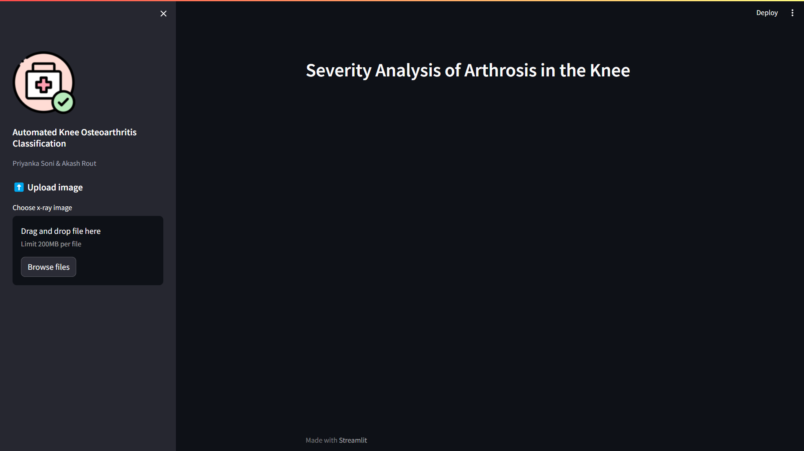
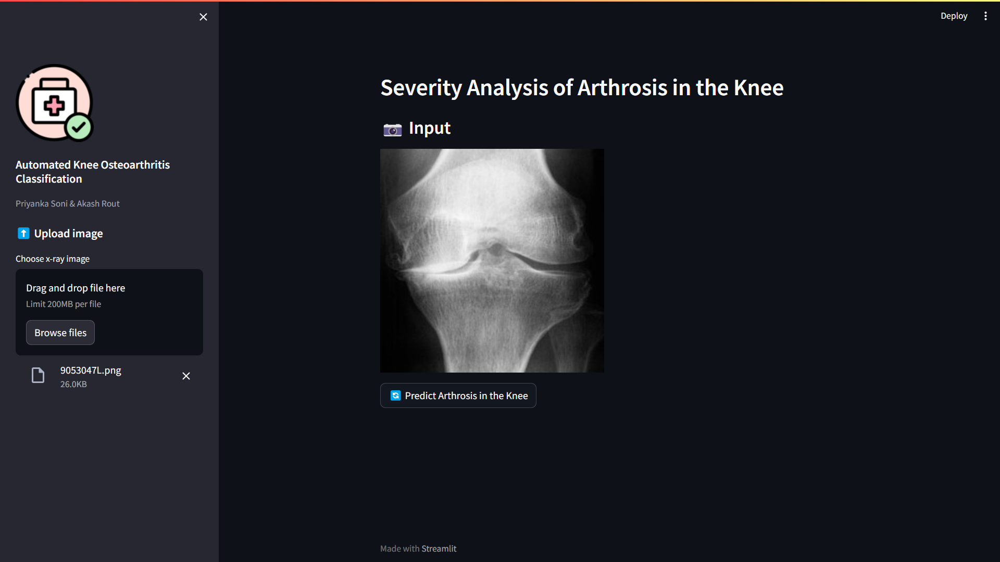
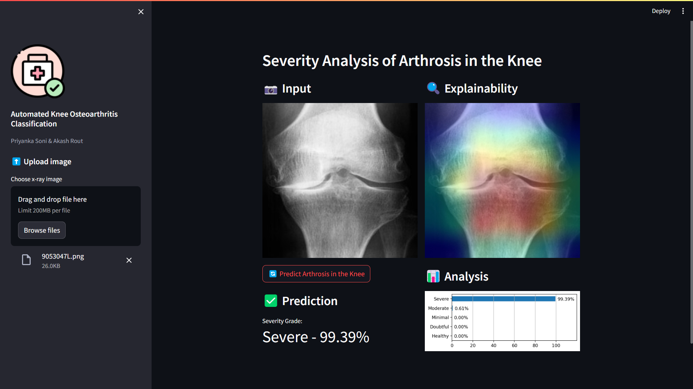

# 🦴 Knee X-ray Image Classifier 🖥️

## Overview 📋

This application utilizes Convolutional Neural Networks (CNNs) to classify knee X-ray images into Kellgren-Lawrence (KL) grades. It offers various CNN architectures, including EfficientNet, Inception, Xception, and ResNet50,each having six different combinations of preprocessing techniques to compare classification accuracy.

## Features 🚀

- **Classify knee X-ray images into KL grades** using different CNN architectures.
- Implement six distinct combinations of preprocessing techniques for data augmentation:
  1. Data Augmentation using Image Data Generator
  2. Data Augmentation using Image Data Generator and Clahe
  3. Data Augmentation using Image Data Generator and HE
  4. Data Replication and CLAHE
  5. Data Replication, Image Cropping, and CLAHE
  6. Data Augmentation using Albumentations Library and Clahe

## Tech Stack 🛠️

- **Framework**: Streamlit
- **Deep Learning Libraries**: TensorFlow, Keras
- **CNN Architectures**: EfficientNet, Inception, Xception, ResNet50

## Usage 🖱️

1. Access the web application through the provided URL.
2. Upload a knee X-ray image.
3. Select the desired CNN architecture and preprocessing technique.
4. Click the "Classify" button to obtain the predicted KL grade.

## Roadmap 🗺️

- Explore additional CNN architectures and preprocessing techniques.
- Improve the user interface for enhanced user experience.
- Integrate model interpretability techniques to provide insights into prediction outcomes.

### Detection and Classification of Knee Osteoarthritis using Deep Learning Techniques 

## Screenshots
  
 
  
 
  
